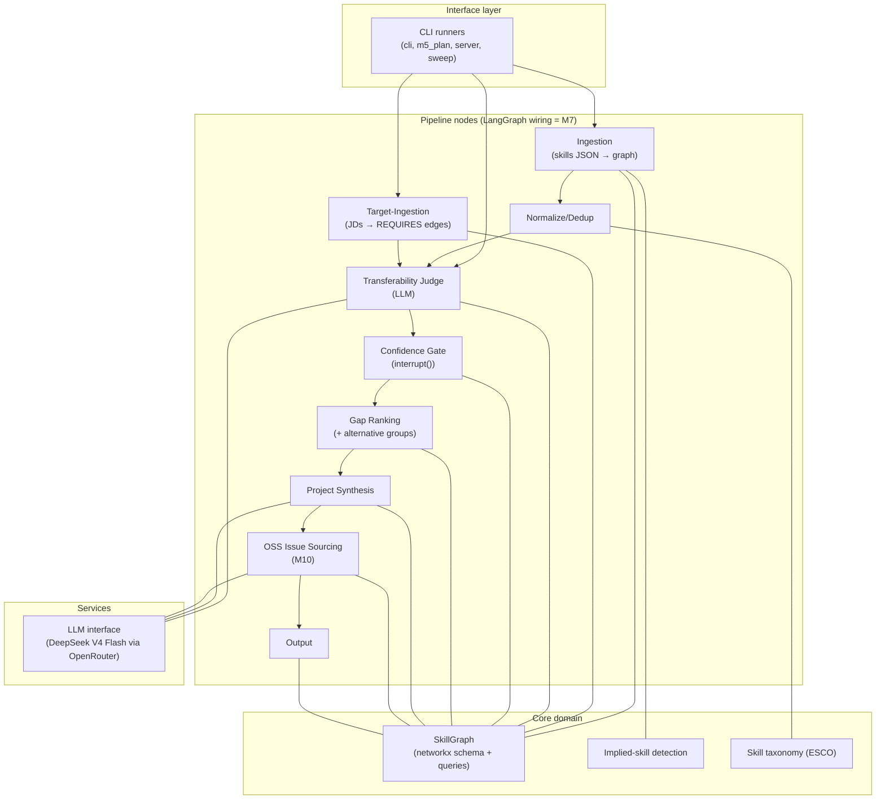

# System Overview

The top-down view of the Skill-Gap Agent: what the system is, its layers and
components, where each lives in code, and how data flows through. This page
is the **map and router** — high-level detail only. Per-stage mechanics live
in S1–S7 (`04-reader.md` through `10-flow-runner.md`); non-stage components
own their own files (`11-sweep.md`, `12-extension.md`, `13-intake.md`);
the Stage Table and the component list below route to them. (Folded from
`2-architecture.md`, 2026-09-27 — that file's stage stubs duplicated the
S-files. The M9 design and graph schema that survived that merge have since
moved to `13-intake.md` and `06-skill-map.md`, their owning files.)

**Status: v1 built and validated** (M1–M6) **; M7–M8 + M10–M13 built; M9 designed**
(order note: M13's extension shell jumped ahead of M9 on user priority
2026-10-03 — the capture → analyze → plan flow works on the M8 resume path;
M9's skill validation improves plan quality but is not a mechanical
prerequisite for it).
All pipeline stages are built and validated against a sealed hand-performed
gap analysis of the same data (rubric in S5 `08-gap-measurer.md`
§Validation rubric — the acceptance criteria and results live there). The
target adds
conversational intake, resume (PDF/DOCX) ingestion, evidence-backed skill
validation, and true LangGraph orchestration — components marked 🎯 Designed
below.

This is a **living target-state document**: it describes the full system we
are building (current end goal = v2), with every component labeled Built
(exists in code) or Designed (specified for an upcoming milestone, no code
yet). See the spec-evolution rules in
[.github/copilot-instructions.md](../.github/copilot-instructions.md).

## What the system does (one paragraph)

Given a user's skills evidence and target job descriptions, the agent builds
a weighted skill graph (networkx), detects skills the CV *implies* but doesn't
state (user-approved), scores how much existing skills transfer to missing
ones (LLM judge), gates uncertain judgments through a human-in-the-loop
prompt, ranks gaps by JD frequency, and outputs a ranked plan of grounded
learning projects. Validated against a sealed hand-performed gap analysis of
the same data (rubric in S5 `08-gap-measurer.md` §Validation rubric).

**Target additions:** users converse with the agent instead of preparing
input files — they hand over a resume (PDF/DOCX) or skills JSON, the agent
extracts skills via one LLM call, validates the depth of ranking-relevant
skills through calibration questions (not a test), and the whole pipeline
runs as a true LangGraph graph with `interrupt()`-based human-in-the-loop
steps (design: [13-intake.md](13-intake.md)).

## Layered Component Map



## Stage Table (router — mechanics live in the S-files)

| Stage | Purpose | Code | Spec | Status |
|---|---|---|---|---|
| S1 reader | Raw text capture (resume + JDs), no AI | `resume.py`, `ingest.py` file loop | [04-reader.md](04-reader.md) | ✅ Built (M2 JSON/TXT; M8 PDF/DOCX) |
| S2 AI caller | Single LLM door (`judge`/`chat`), keyring secrets | `llm.py`, `secrets.py` | [05-ai-caller.md](05-ai-caller.md) | ✅ Built (M3) |
| S3 skill map | Graph store: schema + queries, JSON round-trip | `graph.py` | [06-skill-map.md](06-skill-map.md) | ✅ Built (M1) |
| S4 skill cleaner | Dictionary + both-side cleaning + implied + bridge | `normalize.py`, `taxonomy.py`, `implied.py`, `vocab_bridge.py` | [07-skill-cleaner.md](07-skill-cleaner.md) | ⚠️ Split (manual Built; bridge unwired) |
| S5 gap measurer | Judge + gate + ranking; validation rubric lives here | `judge.py`, `gate.py`, `ranking.py`, `requirements.py` | [08-gap-measurer.md](08-gap-measurer.md) | ✅ Built (M3–M6) |
| S6 practice planner | Standalone synthesis + OSS issues + rendering | `synthesis.py`, `oss.py` (M10), `output.py` | [09-practice-planner.md](09-practice-planner.md) | ✅ Built (M5 + M10 thin slice) |
| S7 flow runner + screen | LangGraph wiring, runners, CLI/HTML screens | `cli.py`, `m5_plan.py`, `server.py` | [10-flow-runner.md](10-flow-runner.md) | ✅ Built (M7–M8 + M11) |

**Non-stage components** (own spec files — same rules as the S-files):

| Component | Purpose | Code | Spec | Status |
|---|---|---|---|---|
| C1 sweep harness | JD-subset evaluation over the built pipeline | `sweep.py`, `m12_check.py` | [11-sweep.md](11-sweep.md) | ✅ Built (M12) |
| C2 extension shell | Browser capture + side-panel gaps/plan | [../extension/](../extension/), `m13_check.py` | [12-extension.md](12-extension.md) | ✅ Built (M13) |
| C3 intake + validation | Conversational input + evidence-backed depth | `intake.py`, `validate.py` (planned) | [13-intake.md](13-intake.md) | 🎯 Designed (M9 — next) |

## Pipeline (stage order = data flow)

```
resume / skills JSON ──▶ S1 reader ──┐
                                     ├──▶ S4 cleaner ──▶ S5 measurer ──▶ S6 planner ──▶ S7 screen
JD texts ────────────▶ S1 reader ────┘         (S2 AI caller + S3 map serve all)
```

## Data Flow at a Glance

```
IN:  data/skillsdataset.json (146 phrases)   data/jds/*.txt (16 JDs)
      │                                        │
      ▼                                        ▼
   canonical skills (118)                target skills (19)
   + implied skills (41)                 + REQUIRES weights
      │                                        │
      └──────────────┬─────────────────────────┘
                     ▼
            SkillGraph (networkx)
                     │
        unmatched targets (17) → LLM judge → TRANSFERS_TO edges
                     │
                     ▼
        confidence gate (M4) → gap ranking (M5) → plan.md (M5)

PERSISTED: output/graph.json (whole graph), output/judge_report.json,
           output/implied_skills.json (approval record)
```

_Counts are a fresh ingestion snapshot on the current seed data (2026-10-03):
118 canonical + 41 implied (the persisted approval record; 23 of those are
still re-proposed by today's patterns) vs. 16 JDs → 19 target skills (of 48
required-skill terms; the rest resolve to held skills) → 17 unmatched. The
judge-edge count is LLM output and varies per run — the M12 sweep
([11-sweep.md](11-sweep.md)) is the mechanism for refreshing numbers like these._

**Target flow (M7–M9):** the IN edge becomes conversational — resume
PDF/DOCX or skills JSON → LLM extraction → skill validation on triaged
skills → proficiency evidence feeds the gate (which shrinks to unvalidated
skills) — and the whole flow runs as a LangGraph graph with `interrupt()`
at the human-in-the-loop points.

## Component designs (high level here — details live in the owning file)

This page routes; it does not host design. Each entry is a summary plus a
link. If you need the mechanics, open the linked file.

- **C1 sweep harness (M12, Built)** — [11-sweep.md](11-sweep.md). Runs the
  pipeline over seeded JD subsets with shared judge/gate/OSS caches, and
  records which subset produced which plan.
- **C2 extension shell (M13, Built)** — [12-extension.md](12-extension.md).
  Chrome side panel: capture JDs on LinkedIn, analyze gaps, generate the
  plan; the pipeline runs in the local `server.py`.
- **C3 intake + skill validation (M9, 🎯 Designed — next)** —
  [13-intake.md](13-intake.md). A tool-calling chat agent assembles the
  input, then ranking-relevant skills are validated with calibration
  questions so the gate gets evidence-backed depth instead of self-report.

## Skill graph schema (summary — canonical reference in S3)

Nodes `Skill` / `JD` / `Project`; edges `HAS_SKILL`, `REQUIRES{weight}`,
`TRANSFERS_TO{confidence, rationale, gate_*}`, `CLOSES_GAP`. Store-agnostic
and deliberately Neo4j-shaped so the store can migrate without redesign.
Full tables, properties and per-edge writers: S3
[06-skill-map.md](06-skill-map.md) §Schema (that file owns `graph.py`).

## Repo Map

```
skill-gap-agent/
├── README.md                  ← project entry point (user quickstart)
├── specs/                     ← you are here (numbered by reading order)
├── data/                      ← seed data (gitignored)
│   ├── skillsdataset.json
│   └── jds/                   ← 16 JD texts
├── extension/                 ← M13: Chrome extension shell (MV3, side panel)
│   ├── manifest.json          ← MV3 manifest (sidePanel + storage; host_permissions = localhost)
│   ├── background.js          ← service worker: opens the side panel on action click
│   ├── content.js             ← LinkedIn JD extraction (port of the bookmarklet logic)
│   ├── sidepanel.html/.js/.css← capture list + Analyze gaps / Generate plan + gap table + plan iframe
│   └── README.md              ← load-unpacked instructions
├── tools/
│   └── linkedin_jd_bookmarklet.js ← S1 helper (pre-extension JD saver)
├── src/skill_gap_agent/
│   ├── graph.py               ← CORE: schema + queries (the system's backbone)
│   ├── normalize.py           ← CORE: canonical terms + aliases
│   ├── ingest.py              ← CORE: ingestion + target-ingestion nodes
│   ├── implied.py             ← CORE: implied-skill detection + proposal flow
│   ├── resume.py              ← M8: resume (PDF/DOCX/TXT) → skills JSON
│   ├── vocab_bridge.py        ← M8: LLM-assisted vocabulary bridge (merge-or-new)
│   ├── taxonomy.py            ← CORE: ESCO loader with fallback
│   ├── llm.py                 ← CORE: provider-agnostic LLM interface (DeepSeek via OpenRouter)
│   ├── judge.py               ← CORE: transferability judge node
│   ├── gate.py                ← CORE: confidence gate (self-assessment: depth + intent)
│   ├── ranking.py             ← CORE: transferability-aware gap ranking
│   ├── requirements.py        ← CORE: alternative-skill groups (any-of semantics)
│   ├── synthesis.py           ← CORE: grounded project synthesis
│   ├── oss.py                 ← M10: GFI sourcing (Search Issues + S2 filter + cache)
│   ├── output.py              ← CORE: plan.md renderer (with JD traceability) + plan.html (M10)
│   ├── cli.py                 ← LangGraph runner (M7): graph wiring + interrupt/resume loop,
│   │                            two-phase pause (M13), oss node + stage listener (M13 completion)
│   ├── server.py              ← M11 local UI + M13 run contract (captured JDs, phase gaps|plan,
│   │                            GET /api/gaps)
│   ├── sweep.py               ← M12: JD-subset sweep harness (seeded sampling + shared caches)
│   ├── m5_plan.py             ← sequential full-pipeline runner (v1 entry, still works)
│   ├── m7_check.py            ← milestone-7 verification: interrupt/resume flow
│   ├── m8_check.py            ← milestone-8 verification: extraction vs seed comparison
│   ├── m10_check.py           ← milestone-10 verification: oss thin slice (offline stub + cache reuse)
│   ├── m11_check.py           ← milestone-11 verification: local UI server (offline stub)
│   ├── m12_check.py           ← milestone-12 verification: sweep harness (offline stub)
│   ├── m13_check.py           ← milestone-13 verification: extension server contract (offline stub)
│   ├── m4_gate.py             ← milestone-4 runner (scaffolding)
│   ├── m3_judge.py            ← milestone-3 runner (scaffolding)
│   ├── m2_check.py            ← milestone-2 verification script (scaffolding)
│   └── smoke_test.py          ← milestone-1 schema test (scaffolding)
├── output/                    ← pipeline artifacts (gitignored): plan.md, plan.html, graph.json,
│                                 gaps.json (M13), judge_report.json, gate_overrides.json,
│                                 implied_skills.json, oss_issues.json,
│                                 captured_jds/ (M13 extension run input)
└── (no .env file)             ← API keys live in the OS keyring only (secrets.py;
                                  env-var override supported). No .env / .env.example.
```

**Scaffolding note:** the `m*_*.py` runners are milestone scripts. Entries:
`m5_plan.py` (v1 sequential runner), `cli.py` (the M7 LangGraph runner — the
primary entry, accepts resume files as of M8). The v2 modules (`intake.py`,
`validate.py`) do not exist yet; creating them is milestone M9. `sweep.py`
(M12) is an evaluation harness, not a runner — it calls the pipeline's stage
functions once per JD subset (see [11-sweep.md](11-sweep.md)).

## Conventions & Guardrails

Code-level conventions every change must follow. This section is **spec
content**: it evolves with the code, and behavior-changing PRs must keep it
accurate (workflow rules live in
[.github/copilot-instructions.md](../.github/copilot-instructions.md)).

- Python 3.11+, pydantic models for structured data, type hints throughout.
- LLM access is centralized in a single module (`llm.py`); parse via its
  JSON-extraction helpers and never call provider SDKs from node modules.
- Human decisions persist as override files in `output/` (e.g.
  `gate_overrides.json`, `implied_skills.json`) and are re-applied silently
  on re-runs — follow this pattern for any new interactive flow.
- Console output must be ASCII-safe (dev machines may run cp1252; use
  `.encode("ascii", "replace")`-style guards for LLM-generated text).
- Data files under `data/` and `output/` are gitignored; never hardcode
  absolute paths — resolve from the package or repo root.
- Canonical skill vocabulary flows through a single normalization module
  (`normalize.py`); never compare raw surface forms.

## Where to Go Next

- **Why these choices:** [02-decisions.md](02-decisions.md)
- **Build order + progress + trade-offs + open questions:** [03-milestones.md](03-milestones.md) (roadmap — §§Deferred/Open hold the rest)
- **Stage mechanics:** S1–S7 files (`04-reader.md` … `10-flow-runner.md`), routed via the Stage Table above
- **Component designs:** [11-sweep.md](11-sweep.md) (C1 sweep harness), [12-extension.md](12-extension.md) (C2 extension shell), [13-intake.md](13-intake.md) (C3 intake + validation, Designed)
- **Skill graph schema:** S3 [06-skill-map.md](06-skill-map.md) §Schema
- **Validation rubric:** S5 [08-gap-measurer.md](08-gap-measurer.md) §Validation rubric
- **Extension end goal:** S6 [09-practice-planner.md](09-practice-planner.md) §End goal