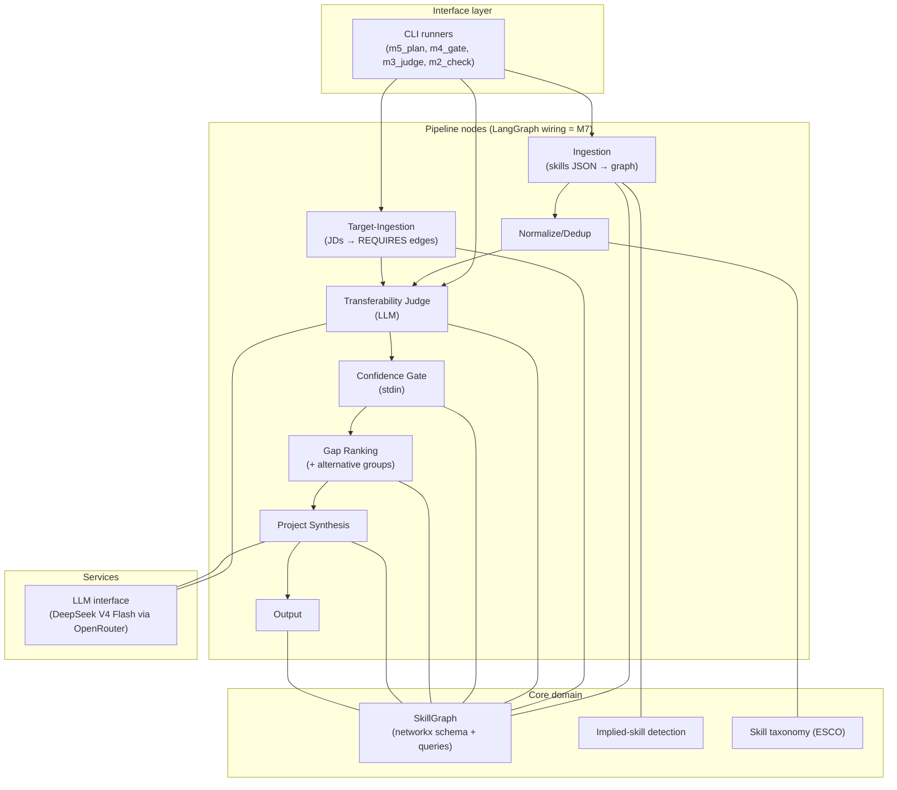

# System Overview

The top-down view of the Skill-Gap Agent: what the system is, its layers and
components, where each lives in code, and how data flows through. This page
is the map **and** the deep-design home for cross-stage concerns (M9 intake
+ validation design, graph schema reference below). Per-stage mechanics live
in S1–S7 (`04-reader.md` through `10-flow-runner.md`); this page's Stage Table
routes to them. (Folded from `2-architecture.md`, 2026-09-27 — that file's
stage stubs duplicated the S-files, so only the M9 design + schema survived
the merge.)

**Status: v1 built and validated** (M1–M6) **; M7–M8 + M10–M11 built; M9 designed**
(GFI-first order: M10 done → M11 → M9, then the extension shell).
All pipeline stages are built and validated against a sealed hand-performed
gap analysis of the same data (rubric in S5 `08-gap-measurer.md`
§Validation rubric); results in the README case study. The target adds
conversational intake, resume (PDF/DOCX) ingestion, evidence-backed skill
validation, and true LangGraph orchestration — components marked 🎯 Designed
below.

This is a **living target-state document**: it describes the full system we
are building (current end goal = v2), with every component labeled Built
(exists in code) or Designed (specified for an upcoming milestone, no code
yet). See the spec-evolution rules in
[.github/copilot-instructions.md](../.github/copilot-instructions.md).

## What the system does (one paragraph)

Given a user's skills evidence and target job descriptions, the agent builds
a weighted skill graph (networkx), detects skills the CV *implies* but doesn't
state (user-approved), scores how much existing skills transfer to missing
ones (LLM judge), gates uncertain judgments through a human-in-the-loop
prompt, ranks gaps by JD frequency, and outputs a ranked plan of grounded
learning projects. Validated against a sealed hand-performed gap analysis of
the same data (rubric in S5 `08-gap-measurer.md` §Validation rubric).

**Target additions:** users converse with the agent instead of preparing
input files — they hand over a resume (PDF/DOCX) or skills JSON, the agent
extracts skills via one LLM call, validates the depth of ranking-relevant
skills through calibration questions (not a test), and the whole pipeline
runs as a true LangGraph graph with `interrupt()`-based human-in-the-loop
steps (M9 design in §M9 design below).

## Layered Component Map



## Stage Table (router — mechanics live in the S-files)

| Stage | Purpose | Code | Spec | Status |
|---|---|---|---|---|
| S1 reader | Raw text capture (resume + JDs), no AI | `resume.py`, `ingest.py` file loop | [04-reader.md](04-reader.md) | ✅ Built (M2 JSON/TXT; M8 PDF/DOCX) |
| S2 AI caller | Single LLM door (`judge`/`chat`), keyring secrets | `llm.py`, `secrets.py` | [05-ai-caller.md](05-ai-caller.md) | ✅ Built (M3) |
| S3 skill map | Graph store: schema + queries, JSON round-trip | `graph.py` | [06-skill-map.md](06-skill-map.md) | ✅ Built (M1) |
| S4 skill cleaner | Dictionary + both-side cleaning + implied + bridge | `normalize.py`, `taxonomy.py`, `implied.py`, `vocab_bridge.py` | [07-skill-cleaner.md](07-skill-cleaner.md) | ⚠️ Split (manual Built; bridge unwired) |
| S5 gap measurer | Judge + gate + ranking; validation rubric lives here | `judge.py`, `gate.py`, `ranking.py`, `requirements.py` | [08-gap-measurer.md](08-gap-measurer.md) | ✅ Built (M3–M6) |
| S6 practice planner | Standalone synthesis + OSS issues + rendering | `synthesis.py`, `oss.py` (M10), `output.py` | [09-practice-planner.md](09-practice-planner.md) | ✅ Built (M5 + M10 thin slice) |
| S7 flow runner + screen | LangGraph wiring, runners, CLI/HTML/extension screens | `cli.py`, `m5_plan.py` | [10-flow-runner.md](10-flow-runner.md) | ✅ Built (M7–M8 + M11) |

## Pipeline (stage order = data flow)

```
resume / skills JSON ──▶ S1 reader ──┐
                                     ├──▶ S4 cleaner ──▶ S5 measurer ──▶ S6 planner ──▶ S7 screen
JD texts ────────────▶ S1 reader ────┘         (S2 AI caller + S3 map serve all)
```

## Data Flow at a Glance

```
IN:  data/skillsdataset.json (146 phrases)   data/jds/*.txt (13 JDs)
      │                                        │
      ▼                                        ▼
   canonical skills (119)                target skills (23)
   + implied skills (23, user-approved)  + REQUIRES weights
      │                                        │
      └──────────────┬─────────────────────────┘
                     ▼
            SkillGraph (networkx)
                     │
        unmatched targets (21) → LLM judge → TRANSFERS_TO edges (122)
                     │
                     ▼
        confidence gate (M4) → gap ranking (M5) → plan.md (M5)

PERSISTED: output/graph.json (whole graph), output/judge_report.json,
           output/implied_skills.json (approval record)
```

**Target flow (M7–M9):** the IN edge becomes conversational — resume
PDF/DOCX or skills JSON → LLM extraction → skill validation on triaged
skills → proficiency evidence feeds the gate (which shrinks to unvalidated
skills) — and the whole flow runs as a LangGraph graph with `interrupt()`
at the human-in-the-loop points.

## §M9 design — conversational intake + skill validation (folded from `2-architecture.md` §§11–12, still Designed)

**Conversational intake.** A tool-calling chat agent fills a `UserProfile`
state slot: collects the resume (PDF/DOCX) or skills JSON, collects JD
texts, asks clarifying questions. Key synergy: the gate's depth/intent
questions can be asked conversationally during intake, collapsing two
interaction points into one conversation segment.

**Skill validation** — evidence-backed proficiency instead of trusting
resume claims. Resumes inflate; self-ratings inflate more; the agent
*elicits* depth through calibration questions. **Framing: calibration, not
a test** — the tool exists to build the user's own learning plan, so no
anti-cheat is needed, only honest framing.
- **Triage (mandatory).** Quizzing every skill is an interrogation. Only
  ranking-relevant skills are validated: high JD `weight`, skills that are
  top-transfer *sources* (their depth drives the confidence
  multiplication), gate-flagged skills. Cap ~10–15 questions total;
  explicitly skippable ("just use my resume as-is" → resume-claim
  fallback).
- **Tiered protocol per triaged skill** (adaptive stop, LangGraph
  subgraph: `generate_question → interrupt → grade → route`):
  1. **Concept checklist** — yes/no on ~4–6 sub-concepts. Cheapest to
     generate reliably and fastest to answer; per-concept granularity
     makes the *pattern* of yesses informative even if individual
     answers inflate.
  2. **One applied question** on a concept the user claimed — "walk me
     through how you'd deduplicate near-identical customer records in
     SQL" — graded by one LLM call against a hidden rubric. Applied
     over trivia: tests capability, and the user's own answer is stored
     as evidence.
  3. **Optional follow-up probe** — only if tier 2 is strong.
  Route: strong → stop or escalate once; vague → downshift and stop.
  Max 2–3 turns per skill.
- **Question authoring & leakage control.** Questions + hidden rubric
  are co-generated in one LLM call (rubric never shown). A mechanical
  string-overlap check between question text and rubric technique names
  catches answer leakage (same spirit as the judge's keyword pruner).
  Authoring is offline and cached, so the full question set is
  reviewable before any user sees it; obscure skills degrade gracefully
  to the self-report tier.
- **Persistence & consumers.** Grades map to the gate's 1–5 depth scale
  and persist to `output/proficiency.json` (same override pattern as
  `gate_overrides.json`); question cache keyed by skill. Consumers:
  (a) the gate's depth question is pre-filled for validated skills —
  the gate shrinks to unvalidated skills only (an explicit, intended
  outcome, not gate redundancy); (b) the judge prompt gains proficiency
  context ("user has SQL at working depth, not expert") for better
  transfer scores.
- **Semantics of a "no".** A failed concept lowers the *skill's* depth
  factor (nudge, never hard-reject — a soft signal modulates
  confidence, it does not remove a skill from the profile). Concept-level
  micro-gaps ("learn window functions" as a plan item) are a recorded
  future idea, not v2 scope.

## Graph Schema (store-agnostic — same shape later in Neo4j; folded from `2-architecture.md`)

**Nodes**

| Label | Key properties |
|---|---|
| `Skill` | `name`, `category`, `source` (`current`\|`target`) |
| `JD` | `title`, `company` |
| `Project` | `title`, `description`, `type` (`standalone` + `oss_issue` since M10) + `url, repo, labels, updated_at` for oss issues |

**Edges**

| Type | From → To | Properties | Written by |
|---|---|---|---|
| `HAS_SKILL` | User (implicit) → `Skill` | — | Ingestion node |
| `REQUIRES` | `JD` → `Skill` | `weight` (frequency across JDs) | Target-ingestion node |
| `TRANSFERS_TO` | `Skill` → `Skill` | `confidence` (0–1), `rationale` (short LLM text) | Transferability-judge node |
| `CLOSES_GAP` | `Project` → `Skill` | — | Output node |

`TRANSFERS_TO` is directional in v1 (see roadmap `03-milestones.md`
§Deferred #9).

## Repo Map

```
skill-gap-agent/
├── README.md                  ← project entry point (user quickstart + case study)
├── specs/                     ← you are here (numbered by reading order)
├── data/                      ← seed data (gitignored)
│   ├── skillsdataset.json
│   └── jds/                   ← 13 JD texts
├── src/skill_gap_agent/
│   ├── graph.py               ← CORE: schema + queries (the system's backbone)
│   ├── normalize.py           ← CORE: canonical terms + aliases
│   ├── ingest.py              ← CORE: ingestion + target-ingestion nodes
│   ├── implied.py             ← CORE: implied-skill detection + proposal flow   ├── resume.py              ← M8: resume (PDF/DOCX/TXT) → skills JSON
   ├── vocab_bridge.py        ← M8: LLM-assisted vocabulary bridge (merge-or-new)│   ├── taxonomy.py            ← CORE: ESCO loader with fallback
│   ├── llm.py                 ← CORE: provider-agnostic LLM interface (DeepSeek via OpenRouter)
│   ├── judge.py               ← CORE: transferability judge node
│   ├── gate.py                ← CORE: confidence gate (self-assessment: depth + intent)
│   ├── ranking.py             ← CORE: transferability-aware gap ranking
│   ├── requirements.py        ← CORE: alternative-skill groups (any-of semantics)
│   ├── synthesis.py           ← CORE: grounded project synthesis
│   ├── oss.py                 ← M10: GFI sourcing (Search Issues + S2 filter + cache)
│   ├── output.py              ← CORE: plan.md renderer (with JD traceability) + plan.html (M10 thin slice)
   ├── cli.py                 ← LangGraph runner (M7): graph wiring + interrupt/resume loop
   ├── server.py              ← M11: stdlib local UI (JD list + Generate + stage poll + JD viewer)
   ├── m5_plan.py             ← sequential full-pipeline runner (v1 entry, still works)│   ├── m10_check.py           ← milestone-10 verification: oss thin slice (offline stub + cache reuse)   ├── m11_check.py           ← milestone-11 verification: local UI server (offline stub)   ├── m7_check.py            ← milestone-7 verification: interrupt/resume flow   ├── m8_check.py            ← milestone-8 verification: extraction vs seed comparison│   ├── m4_gate.py             ← milestone-4 runner (scaffolding)
│   ├── m3_judge.py            ← milestone-3 runner (scaffolding)
│   ├── m2_check.py            ← milestone-2 verification script (scaffolding)
│   └── smoke_test.py          ← milestone-1 schema test (scaffolding)
├── output/                    ← pipeline artifacts (gitignored): plan.md, graph.json,
│                                 judge_report.json, gate_overrides.json, implied_skills.json
└── .env                       ← API keys (gitignored; see .env.example)
```

**Scaffolding note:** the `m*_*.py` runners are milestone scripts. Entries:
`m5_plan.py` (v1 sequential runner), `cli.py` (the M7 LangGraph runner — the
primary entry, accepts resume files as of M8). The v2 modules (`intake.py`,
`validate.py`) do not exist yet; creating them is milestone M9.

## Conventions & Guardrails

Code-level conventions every change must follow. This section is **spec
content**: it evolves with the code, and behavior-changing PRs must keep it
accurate (workflow rules live in
[.github/copilot-instructions.md](../.github/copilot-instructions.md)).

- Python 3.11+, pydantic models for structured data, type hints throughout.
- LLM access is centralized in a single module (`llm.py`); parse via its
  JSON-extraction helpers and never call provider SDKs from node modules.
- Human decisions persist as override files in `output/` (e.g.
  `gate_overrides.json`, `implied_skills.json`) and are re-applied silently
  on re-runs — follow this pattern for any new interactive flow.
- Console output must be ASCII-safe (dev machines may run cp1252; use
  `.encode("ascii", "replace")`-style guards for LLM-generated text).
- Data files under `data/` and `output/` are gitignored; never hardcode
  absolute paths — resolve from the package or repo root.
- Canonical skill vocabulary flows through a single normalization module
  (`normalize.py`); never compare raw surface forms.

## Where to Go Next

- **Why these choices:** [02-decisions.md](02-decisions.md)
- **Build order + progress + trade-offs + open questions:** [03-milestones.md](03-milestones.md) (roadmap — §§Deferred/Open hold the rest)
- **Stage mechanics:** S1–S7 files (`04-reader.md` … `10-flow-runner.md`), routed via the Stage Table above
- **Validation rubric:** S5 [08-gap-measurer.md](08-gap-measurer.md) §Validation rubric
- **Extension end goal:** S6 [09-practice-planner.md](09-practice-planner.md) §End goal