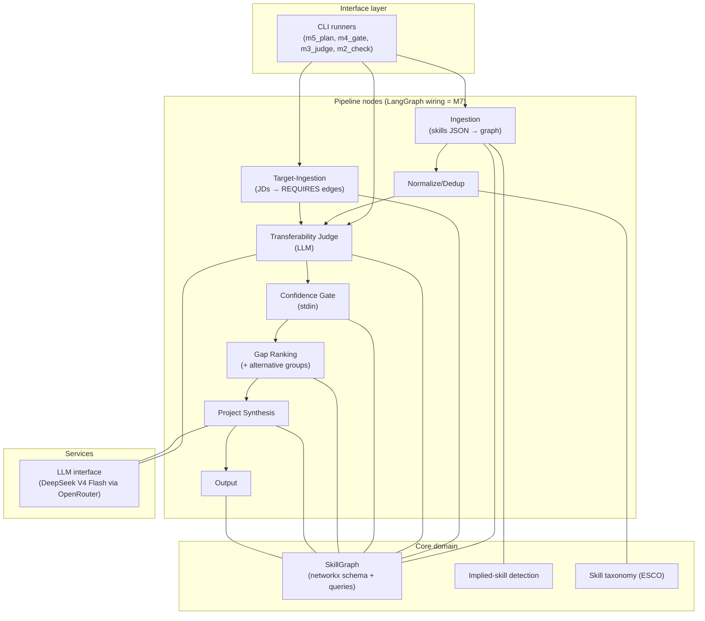

# System Overview

The top-down view of the Skill-Gap Agent: what the system is, its layers and
components, where each lives in code, and how data flows through. This page
is the map **and** the deep-design home for cross-stage concerns (M9 intake
+ validation design, M12 sweep evaluation design, M14 observability design, graph schema reference
below). Per-stage mechanics live in S1–S7 (`04-reader.md` through
`10-flow-runner.md`); this page's Stage Table routes to them. (Folded from
`2-architecture.md`, 2026-09-27 — that file's stage stubs duplicated the
S-files, so only the M9 design + schema survived the merge.)

**Status: v1 built and validated** (M1–M6) **; M7–M8 + M10–M13 built; M9 + M14 designed**
(order note: M13's extension shell jumped ahead of M9 on user priority
2026-10-03 — the capture → analyze → plan flow works on the M8 resume path;
M9's skill validation improves plan quality but is not a mechanical
prerequisite for it).
All pipeline stages are built and validated against a sealed hand-performed
gap analysis of the same data (rubric in S5 `08-gap-measurer.md`
§Validation rubric — the acceptance criteria and results live there). The
target adds
conversational intake, resume (PDF/DOCX) ingestion, evidence-backed skill
validation, and true LangGraph orchestration — components marked 🎯 Designed
below.

This is a **living target-state document**: it describes the full system we
are building (current end goal = v2), with every component labeled Built
(exists in code) or Designed (specified for an upcoming milestone, no code
yet). See the spec-evolution rules in
[.github/copilot-instructions.md](../.github/copilot-instructions.md).

## What the system does (one paragraph)

Given a user's skills evidence and target job descriptions, the agent builds
a weighted skill graph (networkx), detects skills the CV *implies* but doesn't
state (user-approved), scores how much existing skills transfer to missing
ones (LLM judge), gates uncertain judgments through a human-in-the-loop
prompt, ranks gaps by JD frequency, and outputs a ranked plan of grounded
learning projects. Validated against a sealed hand-performed gap analysis of
the same data (rubric in S5 `08-gap-measurer.md` §Validation rubric).

**Target additions:** users converse with the agent instead of preparing
input files — they hand over a resume (PDF/DOCX) or skills JSON, the agent
extracts skills via one LLM call, validates the depth of ranking-relevant
skills through calibration questions (not a test), and the whole pipeline
runs as a true LangGraph graph with `interrupt()`-based human-in-the-loop
steps (M9 design in §M9 design below).

## Layered Component Map



## Stage Table (router — mechanics live in the S-files)

| Stage | Purpose | Code | Spec | Status |
|---|---|---|---|---|
| S1 reader | Raw text capture (resume + JDs), no AI | `resume.py`, `ingest.py` file loop | [04-reader.md](04-reader.md) | ✅ Built (M2 JSON/TXT; M8 PDF/DOCX) |
| S2 AI caller | Single LLM door (`judge`/`chat`), keyring secrets | `llm.py`, `secrets.py` | [05-ai-caller.md](05-ai-caller.md) | ✅ Built (M3) |
| S3 skill map | Graph store: schema + queries, JSON round-trip | `graph.py` | [06-skill-map.md](06-skill-map.md) | ✅ Built (M1) |
| S4 skill cleaner | Dictionary + both-side cleaning + implied + bridge | `normalize.py`, `taxonomy.py`, `implied.py`, `vocab_bridge.py` | [07-skill-cleaner.md](07-skill-cleaner.md) | ⚠️ Split (manual Built; bridge unwired) |
| S5 gap measurer | Judge + gate + ranking; validation rubric lives here | `judge.py`, `gate.py`, `ranking.py`, `requirements.py` | [08-gap-measurer.md](08-gap-measurer.md) | ✅ Built (M3–M6) |
| S6 practice planner | Standalone synthesis + OSS issues + rendering | `synthesis.py`, `oss.py` (M10), `output.py` | [09-practice-planner.md](09-practice-planner.md) | ✅ Built (M5 + M10 thin slice) |
| S7 flow runner + screen | LangGraph wiring, runners, CLI/HTML/extension screens | `cli.py`, `m5_plan.py`, `sweep.py` (M12 eval harness) | [10-flow-runner.md](10-flow-runner.md) | ✅ Built (M7–M8 + M11–M12) |

## Pipeline (stage order = data flow)

```
resume / skills JSON ──▶ S1 reader ──┐
                                     ├──▶ S4 cleaner ──▶ S5 measurer ──▶ S6 planner ──▶ S7 screen
JD texts ────────────▶ S1 reader ────┘         (S2 AI caller + S3 map serve all)
```

## Data Flow at a Glance

```
IN:  data/skillsdataset.json (146 phrases)   data/jds/*.txt (16 JDs)
      │                                        │
      ▼                                        ▼
   canonical skills (118)                target skills (19)
   + implied skills (41)                 + REQUIRES weights
      │                                        │
      └──────────────┬─────────────────────────┘
                     ▼
            SkillGraph (networkx)
                     │
        unmatched targets (17) → LLM judge → TRANSFERS_TO edges
                     │
                     ▼
        confidence gate (M4) → gap ranking (M5) → plan.md (M5)

PERSISTED: output/graph.json (whole graph), output/judge_report.json,
           output/implied_skills.json (approval record)
```

_Counts are a fresh ingestion snapshot on the current seed data (2026-10-03):
118 canonical + 41 implied (the persisted approval record; 23 of those are
still re-proposed by today's patterns) vs. 16 JDs → 19 target skills (of 48
required-skill terms; the rest resolve to held skills) → 17 unmatched. The
judge-edge count is LLM output and varies per run — the M12 sweep
(§M12 design) is the mechanism for refreshing numbers like these._

**Target flow (M7–M9):** the IN edge becomes conversational — resume
PDF/DOCX or skills JSON → LLM extraction → skill validation on triaged
skills → proficiency evidence feeds the gate (which shrinks to unvalidated
skills) — and the whole flow runs as a LangGraph graph with `interrupt()`
at the human-in-the-loop points.

## §M9 design — conversational intake + skill validation (folded from `2-architecture.md` §§11–12, still Designed)

**Conversational intake.** A tool-calling chat agent fills a `UserProfile`
state slot: collects the resume (PDF/DOCX) or skills JSON, collects JD
texts, asks clarifying questions. Key synergy: the gate's depth/intent
questions can be asked conversationally during intake, collapsing two
interaction points into one conversation segment.

**Skill validation** — evidence-backed proficiency instead of trusting
resume claims. Resumes inflate; self-ratings inflate more; the agent
*elicits* depth through calibration questions. **Framing: calibration, not
a test** — the tool exists to build the user's own learning plan, so no
anti-cheat is needed, only honest framing.
- **Triage (mandatory).** Quizzing every skill is an interrogation. Only
  ranking-relevant skills are validated: high JD `weight`, skills that are
  top-transfer *sources* (their depth drives the confidence
  multiplication), gate-flagged skills. Cap ~10–15 questions total;
  explicitly skippable ("just use my resume as-is" → resume-claim
  fallback).
- **Tiered protocol per triaged skill** (adaptive stop, LangGraph
  subgraph: `generate_question → interrupt → grade → route`):
  1. **Concept checklist** — yes/no on ~4–6 sub-concepts. Cheapest to
     generate reliably and fastest to answer; per-concept granularity
     makes the *pattern* of yesses informative even if individual
     answers inflate.
  2. **One applied question** on a concept the user claimed — "walk me
     through how you'd deduplicate near-identical customer records in
     SQL" — graded by one LLM call against a hidden rubric. Applied
     over trivia: tests capability, and the user's own answer is stored
     as evidence.
  3. **Optional follow-up probe** — only if tier 2 is strong.
  Route: strong → stop or escalate once; vague → downshift and stop.
  Max 2–3 turns per skill.
- **Question authoring & leakage control.** Questions + hidden rubric
  are co-generated in one LLM call (rubric never shown). A mechanical
  string-overlap check between question text and rubric technique names
  catches answer leakage (same spirit as the judge's keyword pruner).
  Authoring is offline and cached, so the full question set is
  reviewable before any user sees it; obscure skills degrade gracefully
  to the self-report tier.
- **Persistence & consumers.** Grades map to the gate's 1–5 depth scale
  and persist to `output/proficiency.json` (same override pattern as
  `gate_overrides.json`); question cache keyed by skill. Consumers:
  (a) the gate's depth question is pre-filled for validated skills —
  the gate shrinks to unvalidated skills only (an explicit, intended
  outcome, not gate redundancy); (b) the judge prompt gains proficiency
  context ("user has SQL at working depth, not expert") for better
  transfer scores.
- **Semantics of a "no".** A failed concept lowers the *skill's* depth
  factor (nudge, never hard-reject — a soft signal modulates
  confidence, it does not remove a skill from the profile). Concept-level
  micro-gaps ("learn window functions" as a plan item) are a recorded
  future idea, not v2 scope.

## §M12 design — JD-subset sweep evaluation (Built — M12, validated 2026-10-03)

**Purpose.** A framework to judge how well the system identifies skill gaps
and recommends a learning plan (projects + good-first-issues) for a given
resume against a *set* of job descriptions. It is an **evaluation harness**,
not a pipeline stage: it runs the existing pipeline many times over
different JD subsets and produces a reviewable record.

**Why subsets rather than one run.** A single run over all JDs produces one
plan with no way to tell whether the plan is *right* or merely *plausible*.
Varying the JD set shows whether the plan tracks the input signal: a gap
that appears for one JD and vanishes for another is evidence the ranking
responds to demand; a gap that appears regardless is either a genuine
constant or a bug.

**Sampling.** Two families, both seeded (`random.Random(seed)`) for
replicability:

| Family | Construction | Question it answers |
|---|---|---|
| Random | `k=3` JDs drawn without replacement, `n` draws | Typical-case behaviour; the baseline distribution |
| Contrastive | 3 near-identical JDs; 3 maximally different JDs; all JDs; singletons (`k=1`) | Stability under redundancy, fragmentation under diversity, full-signal baseline, per-JD coherence |

Random-only sampling is deliberately **not** the whole design: with 16 JDs
there are 560 triples and random draws overlap heavily, so most runs would
be near-duplicates of each other. Contrastive subsets buy more information
per run.

**Key insight — most LLM work is subset-independent.** In
[judge.py](../src/skill_gap_agent/judge.py), `judge_target()` scores a target
against `prune_candidates(target, sg.current_skills())`. Current skills come
from the resume (constant across subsets); only the *target list* comes from
the JDs. The judge's score for target `T` is therefore a pure function of
`T` — it does not depend on which subset surfaced `T`. The same holds for
gate overrides (the question is about the user's depth in the *source*
skill — constant) and OSS issues (the query is built from `gap.target`
alone).

Consequence: judge / gate / OSS caches are **shared across all subsets**
(`_shared/`), so a sweep costs ~23 judge calls total instead of
`n_subsets × ~20`. What *is* genuinely subset-dependent: JD ingestion
(which targets exist), `gap_score = weight × (1 − confidence)` (weight =
JDs in the subset), and synthesis (top-N selection + the weight in the
prompt). So: **shared caches, per-subset graphs and plans.**

**Runner shape (design revision 2026-10-03).** `sweep.py` calls the
pipeline's stage functions directly — `ingest_skills_json` + `ingest_jds`,
cached judging, `review_targets`, `rank_gaps`, `synthesize_for_gaps`,
`source_oss_for_gaps`, `write_plan` — the same functions `m5_plan.py` and the
`cli.py` graph nodes call, with every path passed explicitly. The first
design drove the `cli.py` LangGraph graph once per subset; in `--auto` mode
(the only mode a sweep runs) the graph adds no conditional behaviour and no
interrupts, while its hardcoded `output/` paths would have to be threaded
through nodes that M11's server also uses. Direct calls keep the harness
isolated from the shipped runners. The invariant the first design protected —
**never re-implement a pipeline stage inside the harness** — still holds (see
decision rows in [02-decisions.md](02-decisions.md)).

**Output layout** (per-subset directories; no output collision):

```
output/sweeps/<sweep-id>/
├── manifest.json          # seed, k, n, model, temperature, resume + JD hashes
├── index.md               # subset -> JD titles -> top-5 gaps -> plan link
├── metrics.json           # stability / appearance / churn / consistency / grounding
├── _shared/               # judge_report.json, gate_overrides.json, oss_issues.json
└── s01/, s02/, ...        # graph.json, plan.md, plan.html, synthesis_report.json
│                          # + jds/ (the subset's JD copies = membership on disk)
```

**Manifest must record subset membership explicitly.** `Gap.source_jds`
([ranking.py](../src/skill_gap_agent/ranking.py)) records which JDs *mention*
a gap — it does **not** record which JDs were *in the subset*. Without
membership you cannot distinguish "this JD doesn't need Spark" from "this JD
wasn't in the run", which is exactly the confusion that makes manual
inspection useless. Each JD also gets a content hash so a renamed or edited
file cannot silently invalidate an old sweep.

**Pre-computed metrics** (automatic; they tell the reviewer *where* to look
rather than replacing review):

- **Stability** — Jaccard overlap of top-5 gap sets across subset pairs;
  per-gap appearance rate. High variance is itself a finding.
- **Superset consistency** — a gap present in subset A should still appear
  when JDs mentioning it are added. Violations are bugs, not opinions.
- **Rank churn** — rank distribution per gap across subsets (is
  "Fine-tuning" always #1, or does it swing?).
- **Grounding check** — the synthesis prompt requires reusing a named
  existing skill; a string check catches drift.
- **GFI link validity** — HTTP status per issue URL (M10 did this by hand).

**Two-pass manual review** (avoids confirmation bias): (1) score plan
quality with the JD list hidden; (2) reveal the subset and check whether the
plan actually matches what those JDs demand. The gap between the two scores
is the interesting number.

**Replicability caveat.** The seed gives **subset** replicability, not
**output** replicability: `LLMConfig.temperature` is 0.2, so re-running the
same subset will not give byte-identical plans. Sweep runs therefore set
`temperature=0` and record it in the manifest (decision row in
[02-decisions.md](02-decisions.md)).

**Done criteria (met at M12 — verification record in roadmap M12):** (1)
`sweep.py` runs N subsets end-to-end
with shared caches and writes the layout above, and exposes a `--list` dry
run that prints the subsets without any LLM calls; (2) `manifest.json` +
`index.md` let a reviewer jump from any plan to its exact JD subset;
(3) `m12_check.py` verifies the sweep offline (stubbed LLM/search) —
deterministic sampling, no output collision, cache sharing, manifest
completeness; (4) `ruff check .` and `pytest` clean.

## §M13 design — Chrome extension shell (Built — M13, 2026-10-03)

**End-user flow (the S6 end goal, made concrete).** The user browses
LinkedIn job descriptions in Chrome. Clicking the extension action opens a
**side panel** — window-level, it stays open while the user switches tabs or
navigates between JDs. Per JD: click **Capture JD** (appends to an
only-growing list shown in the panel). Then **Analyze gaps** → the ranked
gap table renders in the panel. Then **Generate plan** → projects +
good-first-issues render below the gaps. Nothing navigates away; the local
pipeline does the thinking.

**UI surface = Chrome side panel** (decision rows in
[02-decisions.md](02-decisions.md)). The popup was rejected: it closes on
any click-away, which kills the capture loop (browse JD → return to panel).
The in-page overlay was rejected: navigating to the next JD destroys the
DOM node, so state must survive in extension storage anyway. The side panel
is the platform's answer to exactly this workflow.

**Capture.** A content script on `https://www.linkedin.com/jobs/*` ports the
extraction logic of
[../tools/linkedin_jd_bookmarklet.js](../tools/linkedin_jd_bookmarklet.js)
(find the `[id^="JobDetails_AboutTheJob_"]` block, click its expand button,
take `innerText` + `document.title` + `location.href`). The panel asks the
active tab via `chrome.tabs.sendMessage`; the content script answers with
`{title, url, text}`. The list lives in `chrome.storage.local`
(`capturedJds`, deduped by URL, re-capture updates text). No `tabs` /
`activeTab` permissions: the content script returns everything the panel
needs. JD text is **untrusted web content** — the panel renders it with
`textContent` only, never `innerHTML`.

**Run contract (extension → local server).** `POST /api/run` body:
`{phase, jds, top_n, skills_path?, skip_judge?, skip_oss?, no_llm_oss?}`.

| `phase` | Behaviour |
|---|---|
| `"gaps"` | Write each captured JD to `output/captured_jds/*.txt` (same `title\nurl\n\ntext` shape as the bookmarklet; `ingest.py::ingest_jds` reads the folder unchanged — it replaces `data/jds/` as `jds_path`), then run the `cli.py` graph with `two_phase=True`: the graph pauses at a `pause` node right after `rank` via `interrupt()`; status becomes `paused`. `GET /api/gaps` then serves `output/gaps.json` (written by the rank node). |
| `"plan"` | Resume the paused run (`Command(resume=...)`) through `synthesize` → `oss` → `output`; `GET /plan.html` serves the result. 409 if no run is paused. |
| (absent — legacy M11) | Full one-shot run, as before. |

Single-run guard unchanged (409 while `running`). `skills_path` defaults to
`data/skillsdataset.json` (server `--skills` flag); a resume file works too
(M8 extraction runs before the graph).

**Why one graph with a pause, not two runs.** The pause is the same
`interrupt()` machinery the confidence gate uses (M7): state continuity is
free — the same `SkillGraph` instance and the same `gaps` list flow from
phase 1 into phase 2. A second full run would re-ingest and re-judge (or
require cache plumbing to avoid it). The checkpointer records the pause;
the SkillGraph itself stays in the in-memory runtime registry (decision in
[02-decisions.md](02-decisions.md)), so both phases must run in one server
process — true for the side-panel workflow.

**Judge cache reuse for re-analysis (`reuse_judged`).** The M12 insight —
the judge's score for target `T` is a pure function of `T` — means that
re-analyzing after adding one JD must not re-pay ~20 LLM calls. With
`reuse_judged`, the judge node first copies `TRANSFERS_TO` edges from
`output/graph.json`, then judges only targets still unmatched; the judge
report merges by target. The CLI default stays fresh-judging (the M6
validation semantics); the extension sets the flag.

**Rendering.** The gap table is rendered natively in the panel from
`/api/gaps` JSON. The full plan renders in an
`<iframe sandbox="allow-popups allow-popups-to-escape-sandbox">` pointed at
`/plan.html` — the M10 renderer (self-contained, escaped, no JS) becomes the
side-panel body as S6 predicted. Every plan link carries
`target='_blank' rel='noopener noreferrer'`, so clicking one opens a new
browser tab and can never navigate the iframe away from the plan (amended
2026-10-04 after a user-reported mis-click lost the plan — fix note in
[03-milestones.md](03-milestones.md) M13). The two `allow-popups*` tokens
are what make `target='_blank'` work inside a sandbox at all (without them
the popup is silently blocked or inherits the no-script sandbox);
`allow-scripts` stays off. A **Reopen plan** control re-points the iframe at
`/plan.html` — the file stays on disk, so recovery costs no re-run. JD links
resolve against `data/jds/` **and** `output/captured_jds/` (exact-name
matches only), so extension-run links work too.

**Security posture.** Server binds `127.0.0.1` only. **No CORS headers on
purpose**: the extension calls with `host_permissions` for
`http://localhost:8000/*` + `http://127.0.0.1:8000/*` (which bypass CORS
entirely), while absent `Access-Control-Allow-*` + no `OPTIONS` handler
means hostile web pages can neither read resume-derived gaps nor trigger
runs (JSON `Content-Type` forces a preflight, which fails). Trust model:
any local process can reach the server — same as M11, acceptable for a
personal tool.

**Explicit non-goals (M13):** in-page gap marking on the JD text
(§Deferred #12), generic non-LinkedIn JD pages (content-script matches are
LinkedIn-only, like the bookmarklet), run history, hosting, multi-user
auth, Chrome Web Store packaging.

**Done criteria (met at M13 — verification record in roadmap M13):** (1)
capture → analyze → plan completes from the extension against the local
server; (2) `phase: "gaps"` produces `/api/gaps` and pauses, `phase:
"plan"` resumes to `plan.html` with GFI links; (3) `m13_check.py` verifies
the flow offline (stubbed judge/synthesis/search) — two-phase pause/resume,
captured-JD ingestion, gaps artifact, manifest validity; (4) `ruff check
.` and `pytest` clean.

## §M14 design — Observability + judge evaluation (🎯 Designed — M14, no code yet)

**Purpose.** Two questions the repo cannot answer today. (1) *What happened
inside a run?* — which prompt the judge saw for a target, what it answered,
how long each call took, what it cost, where a retry fired. Today the only
record is console prints plus the persisted `output/*.json` artifacts, which
hold results but not the calls that produced them. (2) *Is the judge right?*
— M3 calibration-checked 5 skills by hand, and M12 measures stability, not
correctness (§Open: sweep ground truth). Nothing tells us whether a prompt or
model change made the judge better or worse. M14 adds **tracing** for (1)
and a **golden-set evaluation** of the judge for (2). Like M12, this is
tooling around the built pipeline, not a new pipeline stage.

**Backend = LangSmith cloud, free Developer tier** (decision rows in
[02-decisions.md](02-decisions.md)). Background for newcomers: LangSmith is
a hosted service from the company behind LangGraph. A program sends it
"traces" — a tree of "runs", one per function or LLM call, each with
inputs, outputs, timing and token counts — and its web UI shows them. It is
already cloud-hosted, so there is nothing to deploy; self-hosting LangSmith
needs an Enterprise licence, which is why it is not the choice here.
LangGraph reports every graph node as a run automatically once tracing is
switched on — but `llm.py` calls the plain `openai` SDK, not LangChain, so
LLM calls are invisible until the client is wrapped (below).

**Tracing is opt-in and off by default.** The project is local-first:
resumes and JDs never leave the machine except to the LLM provider. With
tracing on, prompts — which contain resume-derived skills and JD text — are
also sent to LangSmith. So a run is traced **only** when the user asks:
`--trace` on the runners (`cli.py`, `server.py`, `sweep.py`), or
`LANGSMITH_TRACING=true` in the environment (LangSmith's own variable).
Redaction for sensitive runs: LangSmith's `LANGSMITH_HIDE_INPUTS` /
`LANGSMITH_HIDE_OUTPUTS` env vars keep the tree shape and timings but drop
payloads.

**One module owns tracing: `tracing.py` (to be created in M14).** Same idea
as `llm.py` owning LLM access — no other module imports `langsmith`.

| Function | Does | When tracing is off / `langsmith` missing |
|---|---|---|
| `enable_tracing(project="skill-gap-agent")` | Resolves `LANGSMITH_API_KEY` via `secrets.get_secret()` (env → OS keyring, same as every key); sets `LANGSMITH_TRACING` / `LANGSMITH_API_KEY` / `LANGSMITH_PROJECT` in `os.environ` so LangGraph picks them up; returns `True` if on | Returns `False`; missing key → one ASCII warning line, run continues untraced. **Tracing never fails a run** |
| `wrap_client(client)` | `langsmith.wrappers.wrap_openai(client)` — every `chat.completions.create` becomes a child run with prompt, response, tokens, latency | Returns `client` unchanged |
| `traced(name)` | Decorator = `langsmith.traceable(name=..., run_type="chain")` — labels a stage function so LLM calls nest under it | No-op decorator |
| `run_config(thread_id, cfg)` | Returns LangGraph `config` extras: `run_name`, `tags` (runner name), `metadata` (provider, model, temperature, thread_id) | Returns `{}` extras |

**Where the hooks go** (the only edits to existing modules):

- S2 `llm.py::_client()` returns `tracing.wrap_client(OpenAI(...))`. One
  line; every caller (S1 extraction, S4 bridge, S5 judge, S6 synthesis + OSS
  filter) is covered at once.
- Stage functions get `@traced`: `judge.judge_target`,
  `synthesis.synthesize_project`, `oss.filter_issues_relevance`,
  `resume.extract_skills_llm`, `vocab_bridge.bridge_vocabulary`. The
  target / gap name is a function argument, so it shows up as the run's
  input — the trace for "AWS" is searchable by name.
- Runners call `enable_tracing()` before building the graph and merge
  `run_config(...)` into the existing `{"configurable": {"thread_id": ...}}`.

What a traced CLI run looks like in the LangSmith UI:

```
skill-gap-run  [cli, deepseek-v4-flash-0731, t=0.2]
├── ingest
├── judge
│   ├── judge_target("AWS")      → ChatOpenAI call (prompt, JSON out, 1.2k tok, 3.1 s)
│   ├── judge_target("Spark")    → ChatOpenAI call
│   └── ...
├── gate      (interrupt → resume shows as two node runs; replay, not a bug — S7)
├── rank
├── synthesize
│   └── synthesize_project("Spark") → ChatOpenAI call
├── oss
│   └── filter_issues_relevance(...) → ChatOpenAI call
└── output
```

**Judge golden set — `evals/judge_golden.jsonl` (to be created in M14).**
One JSON object per line: a target skill, the candidate current skills, and
a **human-agreed confidence band** per candidate (a band, not a point:
two careful humans agree on "0.6–0.9", rarely on "0.75").

```json
{"id": "aws-gcp", "target": "AWS", "candidates": ["GCP", "Cloud SQL", "Excel"],
 "bands": {"GCP": [0.5, 0.8], "Cloud SQL": [0.3, 0.6], "Excel": [0.0, 0.3]},
 "source": "M6 hand analysis", "note": "same cloud concepts, different names"}
```

- **Committed to git**, unlike `data/`: rows are generic skill pairs, no
  resume text or personal data. LangSmith gets a *copy* as a dataset; the
  repo file is the version-controlled truth.
- **Seeded** from evidence the repo already has: the M6 sealed hand analysis
  (e.g. LangGraph ← Google ADK high, AWS ← GCP partial — S5
  `08-gap-measurer.md` §Validation rubric) and the M3/M4 records. Target
  size ~30 rows first, growing to 50–100.
- Bands are labeled by the user/author; each row records its `source`.

**Eval runner — `judge_eval.py` (to be created in M14).**
`python -m skill_gap_agent.judge_eval [--langsmith] [--provider P --model M]`.
For each row it builds a small `SkillGraph` holding exactly the row's
candidates as current skills and calls the real `judge_target()` (never a
re-implementation — the M12 invariant). Two metrics, because a judge miss
has two possible causes:

| Metric | Measures | Computed as |
|---|---|---|
| `in_band` | Judge accuracy | share of (row, candidate) pairs whose returned confidence lies inside the band; a candidate the judge drops (below `min_confidence` 0.3) counts as 0.0 |
| `pruner_recall` | Did `prune_candidates()` even show the judge the right skills? | share of high-band candidates (band low ≥ 0.5) that survive pruning — targets the known M3 pruning-miss issue |

Plus `mean_abs_error` to band midpoint and the confidence distribution
(feeds §Open: judge score calibration). Output: a local report
`output/evals/<run-id>.json` **always** (no LangSmith account needed); with
`--langsmith`, the same rows run as a LangSmith **experiment** via
`langsmith.evaluate()`, so runs with different prompts/models sit side by
side in the UI. `temperature=0` for evals, recorded in the report (same
reason as the M12 sweep row).

**CI (two tiers).** Background: GitHub does **not** give repository secrets
to workflows triggered by pull requests from forks, so an eval that needs
an OpenRouter + LangSmith key cannot run on a contributor's fork PR.
Therefore: (a) **every PR** runs the offline tier — `ruff check .`,
`pytest` (incl. `test_m14.py`) — no secrets, no network; (b) the **live
eval** runs on `workflow_dispatch` and on pushes to `main` that touch
`judge.py` / `llm.py` / `synthesis.py`, using the owner's secrets, and fails
if `in_band` drops more than 5 points below the last recorded baseline.
The repo has no `.github/workflows/` today; M14 adds the first one.

**Gate decisions as LangSmith feedback — analysis signal, NOT judge
labels.** M4's redesign is the reason: the gate asks the user about their
depth in the *source* skill and their intent, never whether the judge's
transfer score is right (the user lacks the target skill by definition). So
a gate answer cannot be used as ground truth for the judge. It is still
useful context: when tracing is on, `judge_target()`'s run id is stored in
`judge_report.json` (`trace_run_id`), and `gate.review_targets()` attaches
`gate_depth` / `gate_intent` as feedback on that run — so the UI can
answer "how often does the gate flip a verdict, and for which targets?"
Silently skipped when tracing is off.

**Explicit non-goals (recorded, not oversights):** self-hosting LangSmith
(Enterprise licence) or Langfuse (ops cost — fallback only, decision row);
LLM-as-judge grading of `plan.md` (needs the golden set to calibrate it
first — candidate for a later milestone); tracing the Chrome extension's
JS (the pipeline it triggers in `server.py` *is* traced); online
production monitoring/alerts (single local user today).

**Done criteria:** (1) `--trace` run of `cli.py` on seed data produces one
LangSmith trace tree with every graph node and every LLM call nested under
its stage function; the same run without `--trace` sends nothing and
behaves exactly as before; missing key → warning, run completes. (2)
`evals/judge_golden.jsonl` has ≥30 labeled rows; `judge_eval.py` prints
`in_band` / `pruner_recall` locally, and with `--langsmith` creates an
experiment. (3) `m14_check.py` verifies offline (stubbed LLM, no network):
tracing no-ops when off, `wrap_client` identity when disabled, golden-set
schema valid, metric math on a fixture. (4) CI offline tier green on a PR.
(5) `ruff check .` and `pytest` clean.

## Graph Schema (store-agnostic — same shape later in Neo4j; folded from `2-architecture.md`)

**Nodes**

| Label | Key properties |
|---|---|
| `Skill` | `name`, `category`, `source` (`current`\|`target`) |
| `JD` | `title`, `company` |
| `Project` | `title`, `description`, `type` (`standalone` + `oss_issue` since M10) + `url, repo, labels, updated_at` for oss issues |

**Edges**

| Type | From → To | Properties | Written by |
|---|---|---|---|
| `HAS_SKILL` | User (implicit) → `Skill` | — | Ingestion node |
| `REQUIRES` | `JD` → `Skill` | `weight` (frequency across JDs) | Target-ingestion node |
| `TRANSFERS_TO` | `Skill` → `Skill` | `confidence` (0–1), `rationale` (short LLM text) | Transferability-judge node |
| `CLOSES_GAP` | `Project` → `Skill` | — | Output node |

`TRANSFERS_TO` is directional in v1 (see roadmap `03-milestones.md`
§Deferred #9).

## Repo Map

```
skill-gap-agent/
├── README.md                  ← project entry point (user quickstart)
├── specs/                     ← you are here (numbered by reading order)
├── data/                      ← seed data (gitignored)
│   ├── skillsdataset.json
│   └── jds/                   ← 16 JD texts
├── extension/                 ← M13: Chrome extension shell (MV3, side panel)
│   ├── manifest.json          ← MV3 manifest (sidePanel + storage; host_permissions = localhost)
│   ├── background.js          ← service worker: opens the side panel on action click
│   ├── content.js             ← LinkedIn JD extraction (port of the bookmarklet logic)
│   ├── sidepanel.html/.js/.css← capture list + Analyze gaps / Generate plan + gap table + plan iframe
│   └── README.md              ← load-unpacked instructions
├── tools/
│   └── linkedin_jd_bookmarklet.js ← S1 helper (pre-extension JD saver)
├── src/skill_gap_agent/
│   ├── graph.py               ← CORE: schema + queries (the system's backbone)
│   ├── normalize.py           ← CORE: canonical terms + aliases
│   ├── ingest.py              ← CORE: ingestion + target-ingestion nodes
│   ├── implied.py             ← CORE: implied-skill detection + proposal flow
│   ├── resume.py              ← M8: resume (PDF/DOCX/TXT) → skills JSON
│   ├── vocab_bridge.py        ← M8: LLM-assisted vocabulary bridge (merge-or-new)
│   ├── taxonomy.py            ← CORE: ESCO loader with fallback
│   ├── llm.py                 ← CORE: provider-agnostic LLM interface (DeepSeek via OpenRouter)
│   ├── judge.py               ← CORE: transferability judge node
│   ├── gate.py                ← CORE: confidence gate (self-assessment: depth + intent)
│   ├── ranking.py             ← CORE: transferability-aware gap ranking
│   ├── requirements.py        ← CORE: alternative-skill groups (any-of semantics)
│   ├── synthesis.py           ← CORE: grounded project synthesis
│   ├── oss.py                 ← M10: GFI sourcing (Search Issues + S2 filter + cache)
│   ├── output.py              ← CORE: plan.md renderer (with JD traceability) + plan.html (M10)
│   ├── cli.py                 ← LangGraph runner (M7): graph wiring + interrupt/resume loop,
│   │                            two-phase pause (M13), oss node + stage listener (M13 completion)
│   ├── server.py              ← M11 local UI + M13 run contract (captured JDs, phase gaps|plan,
│   │                            GET /api/gaps)
│   ├── sweep.py               ← M12: JD-subset sweep harness (seeded sampling + shared caches)
│   ├── m5_plan.py             ← sequential full-pipeline runner (v1 entry, still works)
│   ├── m7_check.py            ← milestone-7 verification: interrupt/resume flow
│   ├── m8_check.py            ← milestone-8 verification: extraction vs seed comparison
│   ├── m10_check.py           ← milestone-10 verification: oss thin slice (offline stub + cache reuse)
│   ├── m11_check.py           ← milestone-11 verification: local UI server (offline stub)
│   ├── m12_check.py           ← milestone-12 verification: sweep harness (offline stub)
│   ├── m13_check.py           ← milestone-13 verification: extension server contract (offline stub)
│   ├── m4_gate.py             ← milestone-4 runner (scaffolding)
│   ├── m3_judge.py            ← milestone-3 runner (scaffolding)
│   ├── m2_check.py            ← milestone-2 verification script (scaffolding)
│   └── smoke_test.py          ← milestone-1 schema test (scaffolding)
├── output/                    ← pipeline artifacts (gitignored): plan.md, plan.html, graph.json,
│                                 gaps.json (M13), judge_report.json, gate_overrides.json,
│                                 implied_skills.json, oss_issues.json,
│                                 captured_jds/ (M13 extension run input)
└── .env                       ← API keys (gitignored; see .env.example)
```

**Scaffolding note:** the `m*_*.py` runners are milestone scripts. Entries:
`m5_plan.py` (v1 sequential runner), `cli.py` (the M7 LangGraph runner — the
primary entry, accepts resume files as of M8). The v2 modules (`intake.py`,
`validate.py`) do not exist yet; creating them is milestone M9. `sweep.py`
(M12) is an evaluation harness, not a runner — it drives `cli.py`'s graph
once per JD subset.

## Conventions & Guardrails

Code-level conventions every change must follow. This section is **spec
content**: it evolves with the code, and behavior-changing PRs must keep it
accurate (workflow rules live in
[.github/copilot-instructions.md](../.github/copilot-instructions.md)).

- Python 3.11+, pydantic models for structured data, type hints throughout.
- LLM access is centralized in a single module (`llm.py`); parse via its
  JSON-extraction helpers and never call provider SDKs from node modules.
- Human decisions persist as override files in `output/` (e.g.
  `gate_overrides.json`, `implied_skills.json`) and are re-applied silently
  on re-runs — follow this pattern for any new interactive flow.
- Console output must be ASCII-safe (dev machines may run cp1252; use
  `.encode("ascii", "replace")`-style guards for LLM-generated text).
- Data files under `data/` and `output/` are gitignored; never hardcode
  absolute paths — resolve from the package or repo root.
- Canonical skill vocabulary flows through a single normalization module
  (`normalize.py`); never compare raw surface forms.

## Where to Go Next

- **Why these choices:** [02-decisions.md](02-decisions.md)
- **Build order + progress + trade-offs + open questions:** [03-milestones.md](03-milestones.md) (roadmap — §§Deferred/Open hold the rest)
- **Stage mechanics:** S1–S7 files (`04-reader.md` … `10-flow-runner.md`), routed via the Stage Table above
- **Validation rubric:** S5 [08-gap-measurer.md](08-gap-measurer.md) §Validation rubric
- **Evaluation harness design:** §M12 design above (JD-subset sweeps)
- **Observability + judge evaluation design:** §M14 design above (LangSmith tracing, golden set) — Designed
- **Extension end goal:** S6 [09-practice-planner.md](09-practice-planner.md) §End goal;
  shell design in §M13 design above (side panel + two-phase server contract)