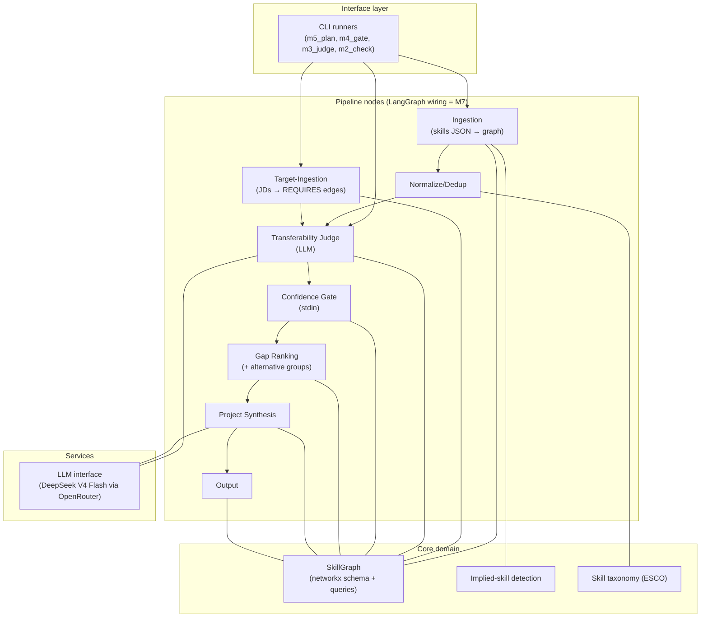

# System Overview

The top-down view of the Skill-Gap Agent: what the system is, its layers and
components, where each lives in code, and how data flows through. Deep detail
lives in [2-architecture.md](2-architecture.md); this page is the map.

**Status: v1 built and validated** (M1–M6) **; v2 designed** (M7–M9).
All pipeline stages are built and validated against a sealed hand-performed
gap analysis of the same data ([4-validation.md](4-validation.md)); results
in the README case study. The v2 target adds conversational intake, resume
(PDF/DOCX) ingestion, evidence-backed skill validation, and true LangGraph
orchestration — components marked 🎯 Designed below.

This is a **living target-state document**: it describes the full system we
are building (current end goal = v2), with every component labeled Built
(exists in code) or Designed (specified for an upcoming milestone, no code
yet). See the spec-evolution rules in
[.github/copilot-instructions.md](../.github/copilot-instructions.md).

## What the system does (one paragraph)

Given a user's skills evidence and target job descriptions, the agent builds
a weighted skill graph (networkx), detects skills the CV *implies* but doesn't
state (user-approved), scores how much existing skills transfer to missing
ones (LLM judge), gates uncertain judgments through a human-in-the-loop
prompt, ranks gaps by JD frequency, and outputs a ranked plan of grounded
learning projects. Validated against a sealed hand-performed gap analysis of
the same data ([4-validation.md](4-validation.md)).

**v2 target additions:** users converse with the agent instead of preparing
input files — they hand over a resume (PDF/DOCX) or skills JSON, the agent
extracts skills via one LLM call, validates the depth of ranking-relevant
skills through calibration questions (not a test), and the whole pipeline
runs as a true LangGraph graph with `interrupt()`-based human-in-the-loop
steps (designed in [2-architecture.md](2-architecture.md) §9–§12).

## Layered Component Map



## Component Table

| Component | Purpose | Code | Spec | Status |
|---|---|---|---|---|
| Graph schema | `SkillGraph`: nodes/edges, queries, JSON round-trip | `src/skill_gap_agent/graph.py` | [2-architecture.md §Graph Schema](2-architecture.md) | ✅ Built |
| Normalization | Canonical terms + alias resolution | `src/skill_gap_agent/normalize.py` | [2-architecture.md §3](2-architecture.md) | ✅ Built |
| Ingestion node | Skills JSON → `Skill` nodes + `HAS_SKILL` | `ingest.py::ingest_skills_json` | [2-architecture.md §1](2-architecture.md) | ✅ Built |
| Implied-skill flow | Detect CV-implied skills, propose with evidence, persist approvals | `implied.py` | [2-architecture.md §1](2-architecture.md) | ✅ Built |
| Target-ingestion node | JD texts → target skills + weighted `REQUIRES` | `ingest.py::ingest_jds` | [2-architecture.md §2](2-architecture.md) | ✅ Built |
| Skill taxonomy | ESCO loader, graceful fallback to built-in tables | `taxonomy.py` | [2-architecture.md §3](2-architecture.md) | ✅ Built (data file pending) |
| LLM interface | Provider-agnostic `judge()`/`chat()`, JSON-out with retries | `llm.py` | [3-decisions.md](3-decisions.md) | ✅ Built |
| Transferability judge | Score `TRANSFERS_TO {confidence, rationale}` per unmatched target skill | `judge.py` | [2-architecture.md §4](2-architecture.md) | ✅ Built |
| Confidence gate | Self-assessment review (depth + intent) of uncertain verdicts | `gate.py` | [2-architecture.md §5](2-architecture.md) | ✅ Built + validated |
| Alternative groups | Any-of capability categories (cloud platforms, DL frameworks, ...) demote satisfied brands | `requirements.py` | [2-architecture.md §6](2-architecture.md) | ✅ Built |
| Gap ranking | Rank gaps by JD weight, transferability-aware | `ranking.py` | [2-architecture.md §6](2-architecture.md) | ✅ Built |
| Project synthesis | Grounded standalone project ideas per gap | `synthesis.py` | [2-architecture.md §7](2-architecture.md) | ✅ Built |
| Output node | Ranked markdown plan + graph persistence | `output.py` | [2-architecture.md §8](2-architecture.md) | ✅ Built |
| LangGraph orchestration | Nodes wired as a real graph; conditional gate as a branch; `interrupt()` + checkpointer replace stdin loops | `cli.py` (scaffold exists) | [2-architecture.md §9](2-architecture.md) | 🎯 Designed (M7) |
| Resume ingestion | PDF/DOCX → text → one LLM extraction call → skills-JSON shape; regex fallback | new `resume.py` | [2-architecture.md §10](2-architecture.md) | 🎯 Designed (M8) |
| Conversational intake | Chat agent collects evidence (resume / JSON / JDs), pre-fills gate questions | new `intake.py` | [2-architecture.md §11](2-architecture.md) | 🎯 Designed (M9) |
| Skill validation | Concept-check + applied-question calibration of triaged skills → proficiency evidence | new `validate.py` | [2-architecture.md §12](2-architecture.md) | 🎯 Designed (M9) |

## Data Flow at a Glance

```
IN:  data/skillsdataset.json (146 phrases)   data/jds/*.txt (13 JDs)
      │                                        │
      ▼                                        ▼
   canonical skills (119)                target skills (23)
   + implied skills (23, user-approved)  + REQUIRES weights
      │                                        │
      └──────────────┬─────────────────────────┘
                     ▼
            SkillGraph (networkx)
                     │
        unmatched targets (21) → LLM judge → TRANSFERS_TO edges (122)
                     │
                     ▼
        confidence gate (M4) → gap ranking (M5) → plan.md (M5)

PERSISTED: output/graph.json (whole graph), output/judge_report.json,
           output/implied_skills.json (approval record)
```

**v2 target flow (M7–M9):** the IN edge becomes conversational — resume
PDF/DOCX or skills JSON → LLM extraction → skill validation on triaged
skills → proficiency evidence feeds the gate (which shrinks to unvalidated
skills) — and the whole flow runs as a LangGraph graph with `interrupt()`
at the human-in-the-loop points.

## Repo Map

```
skill-gap-agent/
├── README.md                  ← project entry point (user quickstart + case study)
├── specs/                     ← you are here (numbered by reading order)
├── data/                      ← seed data (gitignored)
│   ├── skillsdataset.json
│   └── jds/                   ← 13 JD texts
├── src/skill_gap_agent/
│   ├── graph.py               ← CORE: schema + queries (the system's backbone)
│   ├── normalize.py           ← CORE: canonical terms + aliases
│   ├── ingest.py              ← CORE: ingestion + target-ingestion nodes
│   ├── implied.py             ← CORE: implied-skill detection + proposal flow
│   ├── taxonomy.py            ← CORE: ESCO loader with fallback
│   ├── llm.py                 ← CORE: provider-agnostic LLM interface (DeepSeek via OpenRouter)
│   ├── judge.py               ← CORE: transferability judge node
│   ├── gate.py                ← CORE: confidence gate (self-assessment: depth + intent)
│   ├── ranking.py             ← CORE: transferability-aware gap ranking
│   ├── requirements.py        ← CORE: alternative-skill groups (any-of semantics)
│   ├── synthesis.py           ← CORE: grounded project synthesis
│   ├── output.py              ← CORE: plan.md renderer (with JD traceability)
│   ├── cli.py                 ← entry point (pipeline wiring into LangGraph pending)
│   ├── m5_plan.py             ← full-pipeline runner (current primary entry)
│   ├── m4_gate.py             ← milestone-4 runner (scaffolding)
│   ├── m3_judge.py            ← milestone-3 runner (scaffolding)
│   ├── m2_check.py            ← milestone-2 verification script (scaffolding)
│   └── smoke_test.py          ← milestone-1 schema test (scaffolding)
├── output/                    ← pipeline artifacts (gitignored): plan.md, graph.json,
│                                 judge_report.json, gate_overrides.json, implied_skills.json
└── .env                       ← API keys (gitignored; see .env.example)
```

**Scaffolding note:** the `m*_*.py` runners are milestone scripts; `m5_plan.py`
is the current full-pipeline entry. The LangGraph wiring (`cli.py`) that turns
the sequential node calls into a real conditional graph is milestone M7 —
designed in [2-architecture.md §9](2-architecture.md). The v2 modules
(`resume.py`, `intake.py`, `validate.py`) do not exist yet; creating them is
milestones M8–M9.

## Conventions & Guardrails

Code-level conventions every change must follow. This section is **spec
content**: it evolves with the code, and behavior-changing PRs must keep it
accurate (workflow rules live in
[.github/copilot-instructions.md](../.github/copilot-instructions.md)).

- Python 3.11+, pydantic models for structured data, type hints throughout.
- LLM access is centralized in a single module (`llm.py`); parse via its
  JSON-extraction helpers and never call provider SDKs from node modules.
- Human decisions persist as override files in `output/` (e.g.
  `gate_overrides.json`, `implied_skills.json`) and are re-applied silently
  on re-runs — follow this pattern for any new interactive flow.
- Console output must be ASCII-safe (dev machines may run cp1252; use
  `.encode("ascii", "replace")`-style guards for LLM-generated text).
- Data files under `data/` and `output/` are gitignored; never hardcode
  absolute paths — resolve from the package or repo root.
- Canonical skill vocabulary flows through a single normalization module
  (`normalize.py`); never compare raw surface forms.

## Where to Go Next

- **Deep design detail:** [2-architecture.md](2-architecture.md)
- **Why these choices:** [3-decisions.md](3-decisions.md)
- **Build order + progress:** [5-milestones.md](5-milestones.md)
- **What "done" means:** [4-validation.md](4-validation.md)
- **Trade-offs made:** [6-deferred-enhancements.md](6-deferred-enhancements.md)
- **Open questions:** [7-open-items.md](7-open-items.md)